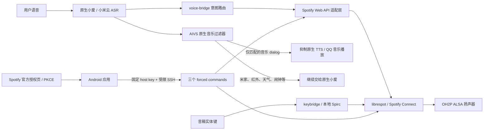

# 架构与信任边界

本文说明各组件为什么存在、数据怎样流动，以及哪些安全边界不能在二次开发时被绕过。它不是安装教程；安装请从[安装与部署](INSTALLATION.md)开始。

## 总览

## 音箱端数据流

### 语音路由

原生 `mico_aivs_lab` 仍负责唤醒词、录音、识别以及小米生态能力。`voice-bridge.sh` 读取最终 ASR 指令，使用明确的中文语法路由音乐请求；它不会把全部语音转交给第三方服务。

当同一 `dialog_id` 被识别为 Spotify 音乐请求时，进程内 AIVS 过滤器只抑制该轮对话后续的原生音乐和相关 TTS，避免 QQ 音乐试听版或会员提示抢占扬声器。未匹配的米家、红外、天气、闹钟等指令继续交给原生处理。

这里采用双重保护：过滤器负责尽早拦截，`stop-native-music.sh` 负责清理已经启动的原生播放器。过滤器二进制在加载前还会核对型号、固件和目标程序哈希；不匹配时必须拒绝加载，而不是猜测 ABI。

### Spotify 播放

`librespot` 作为 Spotify Connect 接收端直接运行在 OH2P 上，通过设备 ALSA 输出音频，因此播放期间不需要电脑常开。

搜索、个人歌单、点赞音乐镜像、随机和循环等动作由 `spotify-web-api.sh` 处理。暂停、继续、上一首、下一首等高频动作优先通过本地 Spirc 控制 socket 发送，失败才退回 Spotify Web API，以减少延迟。

### 实体按键

`keybridge` 与触摸板过滤组件把播放键事件映射到 librespot 的本地控制通道；同时停止可能残留的原生音乐流。这个路径不经过 Spotify Web API，因此正常情况下比云端控制更快。

### 点赞音乐镜像

Spotify 的 Liked Songs 不是普通歌单上下文。设备端分页读取用户收藏并同步到用户自己的私有镜像歌单，然后播放该歌单。默认每日检查一次；手机上新增或取消点赞会在下一次成功同步后反映到音箱。

## Android 端数据流

### 自动接管

Android 应用只在满足本地策略时尝试接管，例如当前网络是 Wi-Fi、没有耳机或其它外接音频路由，并且观察到 Spotify 打开或开始播放。日常接管走 SSH forced command `takeover`，不会发送长期 bearer，也不会保存音箱 root 密码。

应用固定音箱的 SSH host-key 指纹，并把私钥生成在 Android Keystore 中。该私钥不可导出。音箱端登记的手机公钥只能运行以下命令：

- `takeover`
- `spotify-auth-status`
- `spotify-auth-update`

它不能申请 PTY、端口转发或任意 shell。

### Spotify 授权

授权采用 Authorization Code + PKCE：

1. 应用在手机本机 `127.0.0.1` 启动短时回调监听；
2. 系统浏览器打开 Spotify 官方授权页；
3. 应用严格解析 token 响应并校验授权范围；
4. 使用同次返回的 access token 对固定 Spotify HTTPS endpoint 做只读验证；
5. 验证成功后立即擦除 pending bundle 中的 access token；
6. 经受限 SSH 原子下发 refresh token 与授权时间；
7. 音箱成为唯一的日常 refresh 执行者。

PKCE 不需要 Client Secret。公开仓库、APK 和文档都不应内置贡献者的 Client ID、token 或音箱指纹。

## 持久化与启动顺序

运行时数据位于 `/data/xiaoaimusic`。启动顺序为：

1. 挂载并验证受限手机 `authorized_keys`；
2. 在兼容哈希通过时激活原生过滤器；
3. 启动 librespot；
4. 启动语音桥与实体键桥；
5. 启动点赞歌单同步监护。

受限 `authorized_keys` 使用独立 ARM 验证器检查管理员救援 key、手机 forced-command 行、RSA 编码规范和重复 key。授权更新器使用文件锁、原子替换、`fsync` 与事务恢复，避免刷新凭据在断电时出现半提交。

## 不可降低的安全门禁

- 不允许跨型号或跨固件复用 native filter；必须新增兼容档案和实机哈希。
- 不允许把手机公钥改成普通 root SSH key。
- 不允许关闭 SSH host-key 固定，或在首次连接时自动接受未知 key。
- 不允许把 Spotify token、root 密码、签名密钥写进仓库、APK、命令行或日志。
- 不允许把小米固件、rootfs、设备 dump 或第三方刷机工具提交到本仓库。
- 不允许在未验证备份和回滚槽之前修改启动槽。
- 不允许让手机与音箱并发刷新同一个 refresh token；音箱是唯一日常 refresher。

## 兼容性扩展原则

支持新的型号或固件不是修改一个版本字符串。至少需要：

1. 只读采集型号、版本、分区布局和目标二进制哈希；
2. 验证 AIVS ABI、指令对象布局和过滤行为；
3. 为该版本创建独立兼容档案；
4. 加入 fail-closed 哈希门禁和回归测试；
5. 实机验证小爱、米家、红外、天气、闹钟、音乐、实体键、重启和回滚；
6. 在文档中明确标注“实机验证”与“仅有参考元数据”。

不要用“同系列应该一样”代替以上验证。
